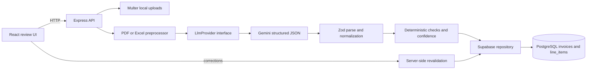

# Document Intelligence Agent: Messy Invoice Extraction

An interview-ready invoice extraction and human-review application by **Yudhveer Singh Panwar**. Upload a PDF or Excel invoice, extract a normalized record with Gemini, see why a value needs review, correct it, and approve it. The project emphasizes recoverable LLM failure, deterministic validation, decimal-safe persistence, and an architecture that is easy to explain.

This is a local take-home application, not an internet-facing invoice service. Authentication, multi-user isolation, deployment, and visual branding are deliberately out of scope.

## What the reviewer can try

1. Generate the four fictional invoices with npm run samples.
2. Apply the migration and configure the two backend services.
3. Start the UI and API with npm run dev.
4. Upload each sample from samples/ and open its review page.
5. The two digital PDFs and the Excel workbook should yield conventional extracted records. The rotated, low-contrast image-only PDF is always flagged needs_review, even when Gemini reads its values.
6. Edit a flagged field and approve. The API revalidates all line arithmetic and the grand total before approval.

The UI has a two-column desktop layout: invoice table and upload panel on the list page, then editable invoice fields and line items alongside validation/evidence notes on the detail page. It collapses to one column on smaller screens. An actual screenshot is omitted because the UI requires each reviewer's configured database and local invoice state.

## Implemented features

- PDF, XLSX, and XLS upload via Multer with a 10 MB default limit, extension/MIME allowlist, magic-byte check, generated UUID filename, and safe source-document endpoint.
- Digital PDF embedded-text extraction. PDFs with fewer than 80 non-whitespace embedded characters are treated as scans based on content, not their filename.
- Image-only PDF multimodal extraction: the original PDF bytes are sent to Gemini with a visual-reading prompt.
- Excel cell-to-text preprocessing with sheet names, row numbers, cell addresses, and merged-range descriptions. Offset and non-tabular headers are retained.
- Official @google/genai SDK, JSON Schema response mode, shared strict Zod validation, and a replaceable LlmProvider interface.
- One repair attempt after malformed JSON or schema failure. Persisted needs_review record, raw model output, and failure reason if repair still fails.
- Decimal.js normalization and arithmetic validation; PostgreSQL numeric columns and string amounts in API types.
- Source-quality, model-uncertainty, completeness, and deterministic-check signals combined for review prioritization.
- Human correction and approval workflow, including line-item add/remove, uncertain-field highlighting, saved manual-correction provenance, and revalidation.
- Atomic invoice-and-line-item replacement through a PostgreSQL function called with Supabase RPC.
- Vitest, Supertest, generated-file preprocessing tests, API workflow tests using a mock provider, and an optional paid Gemini integration command.

## Architecture



The key modules are intentionally small. apps/api/src/preprocessor.ts classifies and represents source documents. llm.ts owns the provider contract and Gemini-specific request. extraction.ts owns the bounded parse/repair flow. validation.ts is pure deterministic business logic. repository.ts maps to normalized PostgreSQL tables. app.ts validates and exposes the HTTP contract.

## End-to-end extraction flow

1. POST /api/documents validates format and signature, writes a UUID-named local file, and creates an uploaded row.
2. POST /api/documents/:id/extract moves the row to processing.
3. The preprocessor extracts PDF text, detects a likely scan, or enumerates Excel cells.
4. Gemini receives a precise prompt and JSON Schema. For scans it also receives the image-only PDF.
5. The response is parsed as JSON and validated with the strict shared Zod schema. Explicit null means unreadable; the app does not fill it with a guess.
6. A malformed or schema-invalid response is sent back once with validation errors for repair. A second failure is saved as needs_review with diagnostic output.
7. Values are normalized, then checked for required fields, plausible dates, positive quantity, nonnegative price, line multiplication, grand-total sum, and scan quality.
8. The score and issues determine extracted versus needs_review. The invoice and its line items are saved atomically.
9. Human edits use PATCH /api/invoices/:id. Approval is rejected with HTTP 422 if deterministic validation still fails. Changed fields remain recorded as manually corrected.

uploaded, processing, extracted, needs_review, approved, and failed are the status values. A preprocessing failure moves to failed; an unrepairable model response becomes needs_review so a human can still enter the values.

## Repository structure

```text
apps/
  api/                 Express, preprocessing, Gemini, validation, repository, tests
  web/                 React/Vite/Tailwind review UI and component test
packages/
  shared/              Strict Zod extraction/correction contracts and API types
supabase/migrations/   PostgreSQL schema, indexes, triggers, atomic save function
samples/               Real source documents, expected fixture, verified live JSON outputs
scripts/               Repeatable sample generation and migration verification SQL
uploads/               Local private source files, ignored by Git
```

samples/expected.json is only test data. No production module imports it. The generated files enter the same upload and preprocessing flow as other user documents.

## Data model

invoices stores one source file and its extraction/review state. Business fields are nullable because unreadable invoices must be representable without invented values. It also stores source type, safe source reference, original and generated names, MIME type, overall score, JSONB uncertainty/validation notes, extraction metadata, raw model output, and timestamps.

line_items stores ordered invoice children with description, decimal quantity, unit price, line total, confidence, review flag, manual-correction flag, and timestamps. invoice_id has ON DELETE CASCADE; (invoice_id, position) is unique. Status, creation-time, vendor, invoice-number, and line-position indexes support the main UI queries. Triggers update updated_at. replace_invoice_data updates the parent and replaces children inside one PostgreSQL transaction; a line constraint failure rolls back the parent update too.

Amounts use PostgreSQL numeric(18,4) and quantities use numeric(18,6). The API returns them as strings so a browser does not silently introduce binary floating-point drift. Decimal.js performs calculations before writes.

## API

| Method | Route                      | Purpose                                             |
| ------ | -------------------------- | --------------------------------------------------- |
| GET    | /api/health                | Service configuration/readiness summary             |
| POST   | /api/documents             | Multipart upload; form field document               |
| POST   | /api/documents/:id/extract | Synchronous extraction and validation               |
| GET    | /api/documents/:id/source  | View/download the stored source for that invoice ID |
| GET    | /api/invoices              | List newest invoice records                         |
| GET    | /api/invoices/:id          | Invoice and ordered line items                      |
| PATCH  | /api/invoices/:id          | Save corrections or approve after validation        |

Errors use a consistent JSON error object with code, message, and optional details. Route IDs and correction bodies are validated. Provider responses, credentials, and local upload paths are not included in public error messages.

## Local setup

Requirements: Node.js **20.19+ or 22.12+** (24 is also supported), npm, and a Supabase project. A Gemini API key is required only for live extraction. This development machine's default Node 20.17 is below Vite's declared minimum, so use a supported Node release when reviewing the project.

```powershell
cd C:\Users\Yudhveer\document-intelligence-agent
npm install
Copy-Item .env.example .env
# Edit .env locally; never commit it.
npm run samples
npm run dev
```

Open http://localhost:5173. The API listens on http://localhost:4000 by default. npm run dev starts both processes. The root .env is explicitly loaded by the API and used as Vite's environment directory. If credentials are absent, /api/health reports degraded; upload/list/extract routes return specific configuration errors rather than an opaque crash.

### Supabase migration

Create a project in Supabase, open its SQL Editor, and run supabase/migrations/202609200001_create_invoice_schema.sql once. This creates the tables, enums, constraints, indexes, update triggers, and the atomic save function. Enter the project URL and **service-role key** in the backend-only root .env. Do not use the public anon key for this server repository.

The migration was also applied to an isolated local PostgreSQL 18 cluster during development. scripts/verify-migration.sql exercised a successful atomic save and rollback on a line-item constraint violation. The verification script runs in a transaction and rolls back its test record.

### Environment variables

| Variable                  | Use                                                       |
| ------------------------- | --------------------------------------------------------- |
| SUPABASE_URL              | Supabase project URL                                      |
| SUPABASE_SERVICE_ROLE_KEY | Backend-only database key                                 |
| GEMINI_API_KEY            | Backend-only Gemini key                                   |
| GEMINI_MODEL              | Defaults to gemini-3.5-flash-lite                         |
| PORT                      | API port, default 4000                                    |
| CORS_ORIGIN               | Local UI origin, default http://localhost:5173            |
| UPLOAD_DIR                | Local private source directory, default ./uploads         |
| MAX_UPLOAD_MB             | Upload cap, default 10                                    |
| VITE_API_URL              | Public browser API URL, default http://localhost:4000/api |

No secret belongs in a VITE_ variable.

### Commands

| Command                  | Purpose                                                                                     |
| ------------------------ | ------------------------------------------------------------------------------------------- |
| npm install              | Install all workspaces                                                                      |
| npm run dev              | Start API and UI together                                                                   |
| npm run samples          | Regenerate the four source documents and expected fixture                                   |
| npm run samples:extract  | Run all samples through configured Gemini and write independently verified JSON outputs     |
| npm test                 | Mocked, no-paid-call automated tests                                                        |
| npm run test:integration | Optional real Gemini extraction against all four generated samples; requires GEMINI_API_KEY |
| npm run lint             | ESLint                                                                                      |
| npm run typecheck        | All TypeScript projects                                                                     |
| npm run build            | Shared package, backend, and frontend production builds                                     |
| npm run format:check     | Prettier verification                                                                       |
| npm run format           | Apply Prettier                                                                              |

## Generated samples

| File                      | Challenge                                                                               |
| ------------------------- | --------------------------------------------------------------------------------------- |
| 01-clean-conventional.pdf | Clean embedded text, conventional table                                                 |
| 02-alternate-layout.pdf   | Embedded text with sidebar, statement labels, changed ordering                          |
| 03-difficult-scan.pdf     | Image-only, slightly rotated and low-contrast; invoice reference is intentionally faint |
| 04-offset-invoice.xlsx    | Offset header, merged cells, a non-tabular bill-to area, and line items below           |

The scan is image-only; embedded-text classification returns scanned_pdf even if it is renamed to a clean-looking filename. The expected values in samples/expected.json let tests inspect fixture integrity without supplying those values to production extraction. Run npm run samples, then use the UI file picker or drop each file onto the upload area. The optional integration test makes real Gemini calls and may incur API usage.

`samples/output/` contains four sanitized outputs produced with Gemini through the same `ExtractionService` used by uploaded documents. The `npm run samples:extract` command performs extraction first and only then compares the normalized result with the independent fixture; expected values are never included in the model prompt or production extraction path. The difficult scan remains `needs_review` because content-based preprocessing identifies it as image-only, even when all visible values are read correctly.

## Reliability and review policy

The shared schema is strict: required JSON keys, bounded 0-1 confidence values, no unexpected keys, and explicit nulls for unreadable fields. The provider prompt forbids fabrication and document-borne instructions. Model confidence alone is insufficient: a confident model can misread a digit or produce internally inconsistent totals. Deterministic checks are independent evidence. A line must satisfy quantity × unit price ≈ line total, and line totals must add to the grand total. The absolute monetary tolerance is **$0.02** for each comparison, allowing ordinary cent rounding while keeping larger mismatches visible.

The overall score is a **review-prioritization heuristic, not a calibrated statistical probability**:

```text
35% required-field completeness
30% deterministic validation (error and warning penalties)
20% source quality (digital PDF 0.97, Excel 0.94, scanned PDF 0.58)
15% average model-reported field confidence
```

Any validation issue, explicitly uncertain field, low model confidence below 0.70, score below 0.82, or image-only scan yields needs_review. Scans are flagged regardless of the score because a noisy character can produce a plausible but wrong invoice number. A human must look at the original source. The retry limit is one repair call: an endless repair loop adds cost and latency and can amplify guesses without improving evidence. Invalid output is persisted for diagnosis rather than replaced with fabricated values.

After a human correction, the API rechecks the entire invoice. It records only fields whose values changed as manually corrected, while retaining the original extraction score instead of pretending approval made the model more certain. approved means a human accepted a deterministically valid record, not that the model was statistically correct.

## Security and technical trade-offs

- The service-role key never reaches React. The API uses safe generated filenames and an invoice-ID source endpoint; no request can ask it to serve an arbitrary path. The upload gate checks size, extension, MIME type, and file signature. It is not an antivirus scanner.
- Local disk storage is reasonable for a single-machine take-home exercise and makes source review simple. Production would use Supabase Storage or object storage with private buckets, signed URLs, retention, and lifecycle rules. Local files are not portable across horizontally scaled API instances.
- The endpoint performs extraction synchronously to keep the assignment understandable. In production the expensive PDF/OCR and Gemini steps would move to a job queue with durable retries, cancellation, a dead-letter path, and progress events. The database statuses already make that transition straightforward.
- Production idempotency would use an upload content hash or client idempotency key and an atomic claim on uploaded records. Rate limiting would protect upload and LLM spend. Antivirus scanning would run before parsing. OpenTelemetry traces, structured logs with redaction, model/version metadata, validation metrics, and alerting would provide observability. Object storage would replace local uploads.
- The API has no authentication or tenant isolation by design. It must remain on a trusted local network. Before deployment, add Supabase Auth or equivalent, row-level security, authorization on source downloads, CSRF/CORS review, and a user-to-invoice ownership model.
- The application does not independently OCR a scan; it sends the image-only PDF to Gemini. This avoids a platform-specific OCR dependency but makes scan accuracy and cost provider-dependent.

## Known limitations and next steps

Real Gemini quality varies with handwriting, tax/discount presentation, page count, languages, and source resolution. The model may extract a legitimate tax as a separate line or miss it; arithmetic validation then forces review. Ambiguous numeric dates are rejected instead of guessed. The synchronous API may time out on very large or complex documents. The app does not deduplicate repeated uploads. A future version would add source-region citations for each field, provider fallback, queue-based processing, audit-history tables, and benchmarked confidence calibration.

No authentication, multi-user features, production deployment, elaborate animation, payments, or notifications were added because they do not improve the central extraction-and-review assignment.
